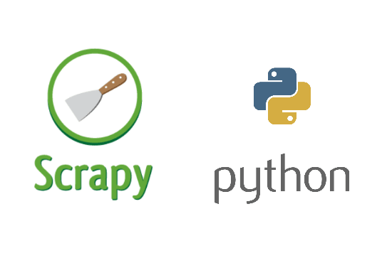
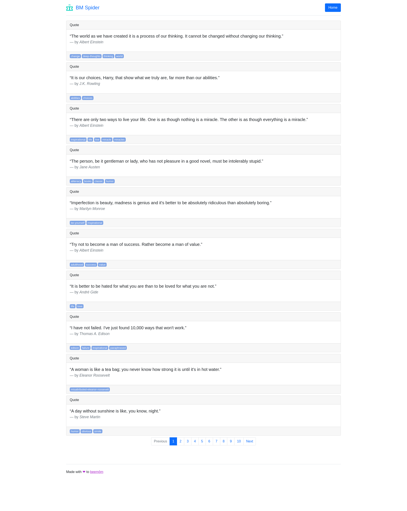
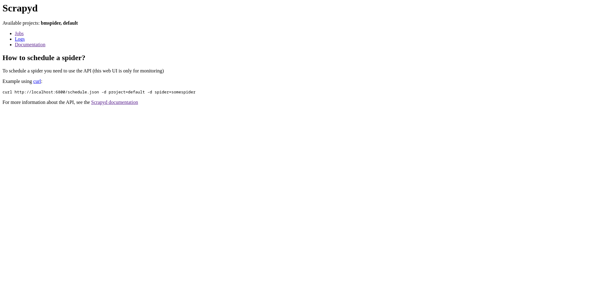

<p align="center">
  <a href="https://github.com/christianalcantara/ntk">
    
  </a>
</p>

<h2 align="center" style="color: white;" ali>Python Scrapy</h3>

<ol>
<li>
  <a href="#sobre-o-projeto">Sobre o Projeto</a>
</li>
<li>
  <a href="#começando">Começando</a>
</li>
<li>
  <a href="#mãos-na-massa">Mãos na massa</a>
</li>
<li>
   <a href="#explore">Executando</a>
</li>
</ol>

<!-- SOBRE O PROJETO -->

## Sobre o Projeto

<details>

# beeMôn:

Na beeMôn criamos muitos sistemas de raspagem de dados e buscamos todos os dias inovação na analise dos dados. Este desafio esta aberto para todos que quiserem abrir um fork e submeter suas ideias de tecnologia.

## Desafio:

Escolher uma dos sites abaixo para fazer o desafio

- [quotes.toscrape](https://quotes.toscrape.com/)
- [imdb.com](https://www.imdb.com/chart/top/?ref_=nv_mv_250)

### Minimo Entregável:

- Buscar dados de forma automatizada(script de linha de comando ou interface clicavel)
- Padronizar os retornos de forma estruturada (json/csv)
- Sistema de logs de para acompanhamento da execução
- Ter um prova da consulta (Screenshot)

### Pontos Extra para:

- Armazenamento dos resultados em um banco relacional ou não relacional
- fazer um dataframe que possibilite visualizar os resultados via pandas
- Trazer resultados de forma dinamica sem fixar caminhos no `xpath`
- Dockerizar a aplicação
- Conseguir agendar uma execução para um dia e horario.

### Libs sugeridas:

- Selenium
- Scrapy
- Pandas
- Requests
- BeautifulSoup

### O que iremos avaliar:

- Conhecimento em HTML
- Conhecimento em fluxo de request/response
- Conhecimento em extração de dados
- Conhecimento em base64
- Boas práticas de programação
- Utilização de bibliotecas de terceiros
- Documentação
- Criatividade
- Cobertura de testes
- Tempo de execução do código
- Versionamento do código

</details>

<!-- COMEÇANDO -->

## Começando

Para executar o projeto é necessário ter o Docker + Docker Compose instalado.

https://docs.docker.com/compose/install/

#### Baixe o repositório do github

```bash
$ git clone https://github.com/christianalcantara/bmspider.git
```

#### Instalação

```bash
$ cd plp # Acessar o diretório do projeto
$ docker compose up
# ou
$ docker-compose up

# se necessário use o parâmetro --build no final dos comandos acima.
# Geralmente utilizado quando há modificações no código fonte.
$ docker-compose up --build
```

<!-- USABILIDADE -->

## Mãos na massa

Se tudo deu certo accese as seguintes url:

1. Webserver
   - http://localhost:5000 **Interface web para vizualizar os dados raspados.**
2. Scrapyd - **Aplicativo para implantar e executar Scrapy spiders.**
   - http://localhost:6800

<table>
<thead>
    <tr style="border: #e24545">
        <td style="width: 50%; border: unset">Webserver</td>
        <td style="width: 50%; border: unset">Scrapyd</td>
    </tr>
    <tr style="border: #e24545">
        <td style="width: 50%; border: unset"></td>
        <td style="width: 50%; border: unset"></td>
    </tr>
</thead>
</table>

## Explore

✨ 🍰 ✨

#### Para egendar uma execução, execute:

```bash
curl http://localhost:6800/schedule.json -d project=bmspider -d spider=quotestoscrape
```

[](https://asciinema.org/a/yifoQm2HoOv5DYCf0qVZPz6PE)

_Acesse a url: http://localhost:6800/jobs para visualizar o andamento e acessar o log._
